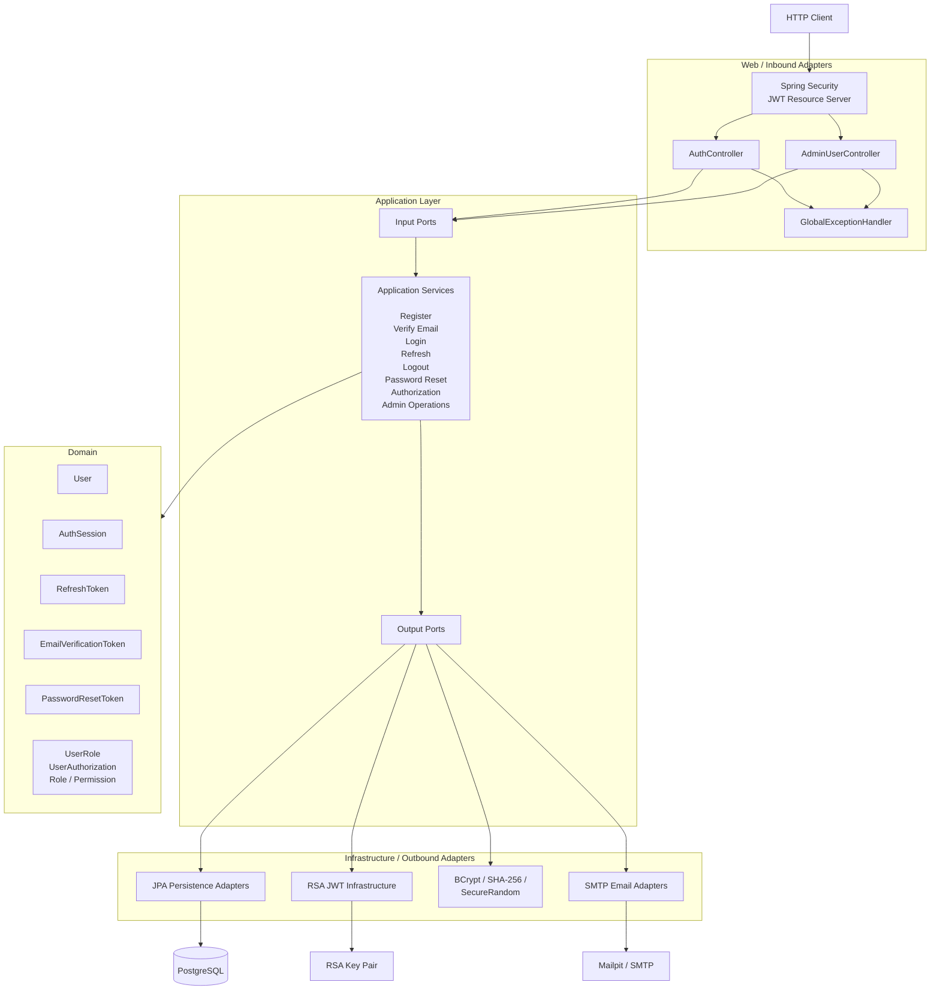
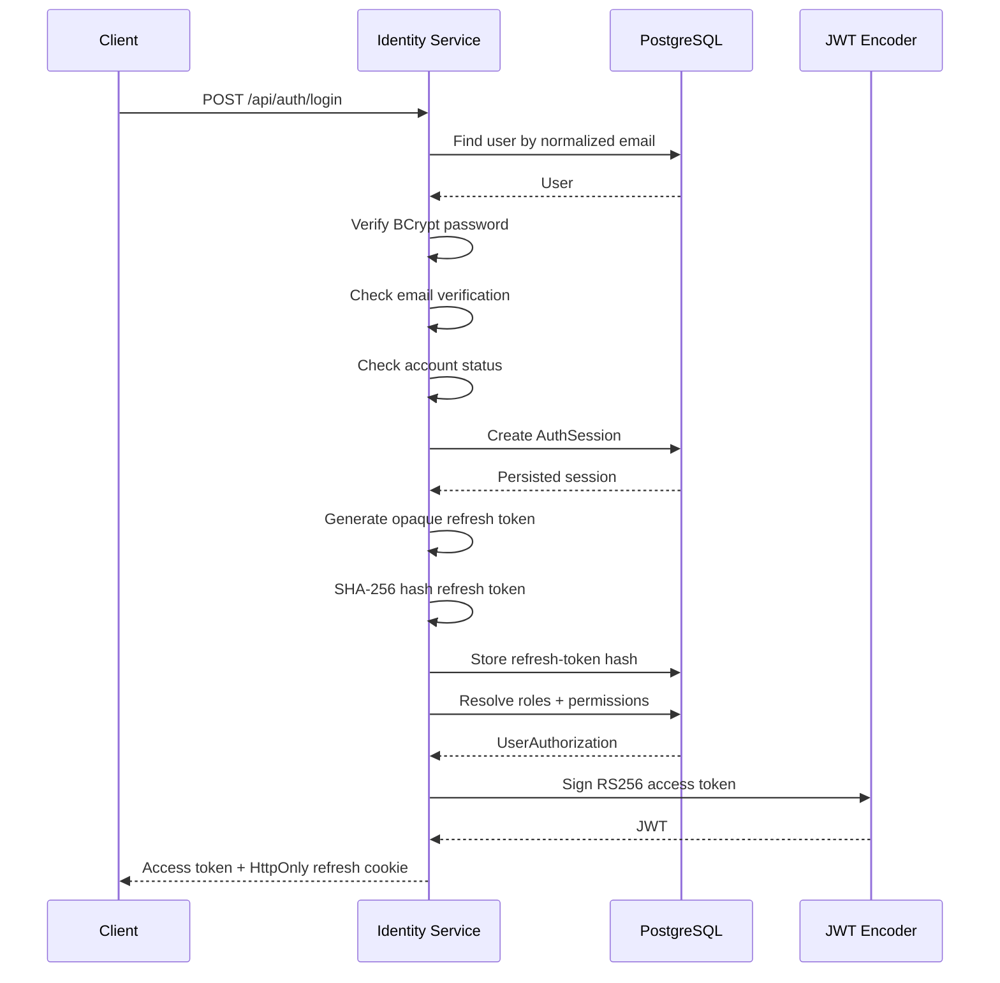
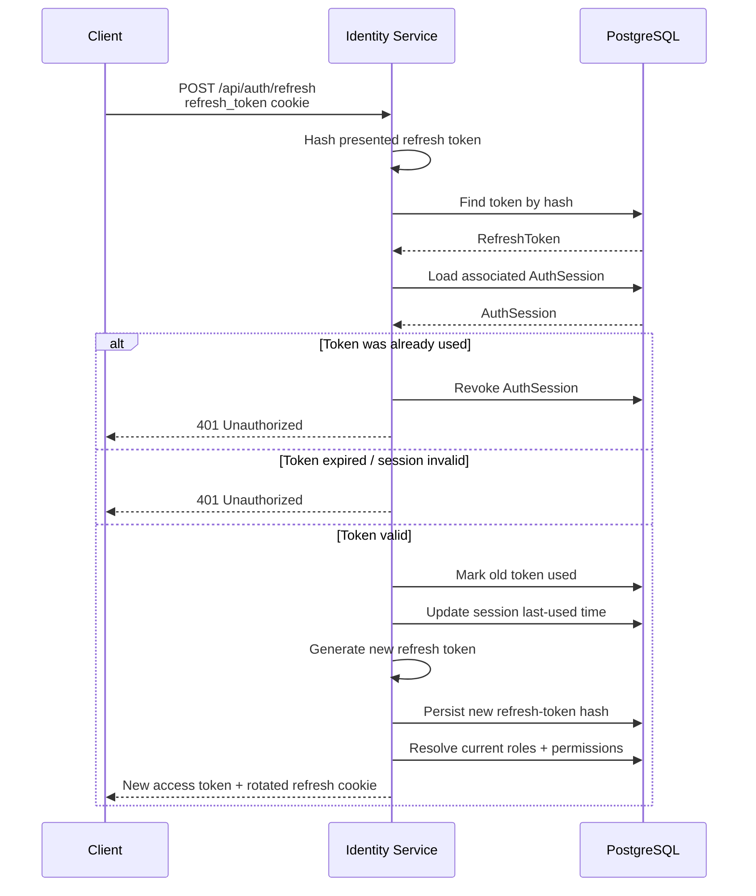
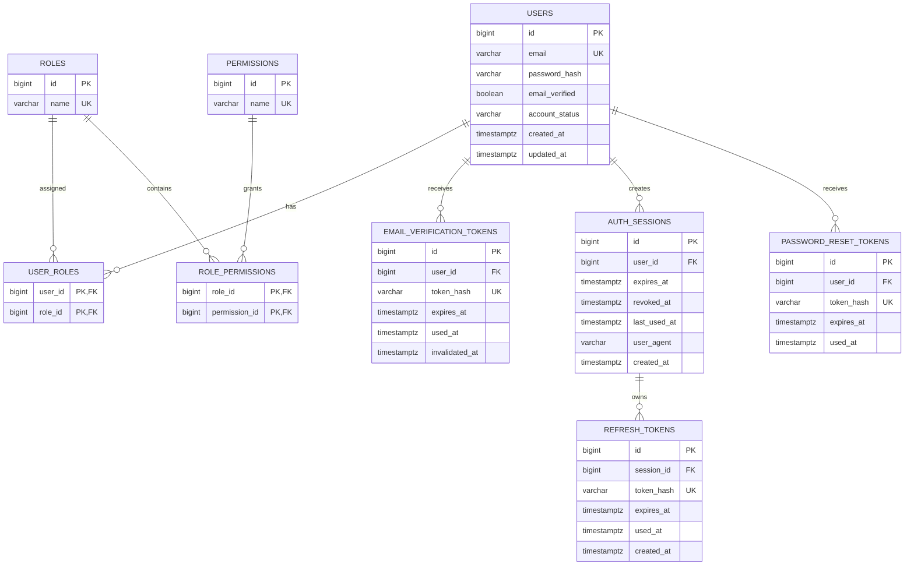

# Secure Authentication & Identity Service

A security-focused identity and access management backend built with **Java 21**, **Spring Boot**, **Spring Security**, **PostgreSQL**, and **Docker**.

The service implements a complete authentication lifecycle including registration, email verification, password authentication, RSA-signed JWT access tokens, stateful refresh-token sessions, refresh-token rotation with replay detection, logout and global session revocation, password reset, and role-based access control (RBAC).

The project is structured around **ports and adapters / hexagonal architecture**, keeping the domain and application layers independent from Spring Data JPA, SMTP, JWT libraries, and HTTP infrastructure.

---

## Highlights

- User registration with normalized email addresses and password policy validation
- BCrypt password hashing
- Email verification with one-time hashed verification tokens
- Authentication session tracking
- RSA / RS256 signed JWT access tokens
- Short-lived access tokens with embedded role and permission claims
- Opaque refresh tokens stored only as SHA-256 hashes
- Refresh-token rotation
- Refresh-token replay detection and automatic session revocation
- Logout and logout-all-sessions support
- Password reset with one-time expiring tokens
- Password reset invalidates all existing authentication sessions
- Role-based access control with `USER`, `MODERATOR`, and `ADMIN`
- Fine-grained permission authorization with Spring Security
- Administrative user management
- PostgreSQL schema managed through Flyway migrations
- SMTP-based verification and password-reset emails
- Request correlation using `X-Request-ID`
- Extensive unit, persistence, security, controller, and integration tests
- PostgreSQL integration tests using Testcontainers
- Fully containerized development environment with Docker Compose

---

# Architecture

The project uses a **ports-and-adapters architecture**.

The application core defines the business model and the capabilities it requires. Infrastructure implementations depend inward on those abstractions rather than application services depending directly on frameworks such as Spring Data JPA or SMTP.



## Dependency Direction

The important dependency rule is:

```text
Web / Infrastructure
        ↓
Application
        ↓
Domain
```

The application layer does not depend directly on JPA repositories, SMTP implementations, JWT encoders, or HTTP controllers.

For example:

```text
AdminUserController
        ↓
UserDisabler                 ← input port
        ↓
DisableUserService
        ↓
UserRepository               ← output port
        ↓
JpaUserRepositoryAdapter
        ↓
PostgreSQL
```

This keeps business use cases independent from transport and persistence details.

---

# Project Structure

```text
src/main/java/com/spsk1313/identityservice
├── identity
│   ├── application
│   │   ├── command
│   │   ├── exception
│   │   ├── policy
│   │   ├── port
│   │   │   ├── in
│   │   │   └── out
│   │   ├── result
│   │   └── service
│   │
│   ├── domain
│   │   ├── authentication
│   │   ├── authorization
│   │   ├── exception
│   │   └── verification
│   │
│   ├── infrastructure
│   │   ├── config
│   │   ├── email
│   │   ├── persistence
│   │   │   ├── adapter
│   │   │   ├── entity
│   │   │   ├── mapper
│   │   │   ├── projection
│   │   │   └── repository
│   │   └── security
│   │       └── jwt
│   │
│   └── web
│       ├── controller
│       ├── cookie
│       ├── error
│       ├── request
│       └── response
│
└── shared
    └── web
```

---

# Authentication Model

The service deliberately separates **access tokens**, **refresh tokens**, and **authentication sessions**.

## Access Token

Access tokens are:

- JWTs
- signed with **RSA / RS256**
- short-lived
- stateless once issued
- returned in the login / refresh JSON response
- used as Bearer tokens
- populated with the user's current roles and permissions

Example claims:

```json
{
  "sub": "42",
  "email": "user@example.com",
  "roles": [
    "USER",
    "MODERATOR"
  ],
  "permissions": [
    "USER_READ",
    "SESSION_REVOKE"
  ],
  "iss": "http://localhost:8080",
  "iat": 1787530757,
  "exp": 1787531657,
  "jti": "unique-token-id"
}
```

The default access-token lifetime is:

```text
15 minutes
```

## Refresh Token

Refresh tokens are:

- opaque random values
- long-lived relative to access tokens
- delivered through an `HttpOnly` cookie
- associated with a server-side authentication session
- stored in PostgreSQL only as a hash
- rotated every time they are used
- single-use
- protected against replay

The raw refresh token is never persisted.

## Authentication Session

Each successful login creates an `AuthSession`.

A session tracks:

- the owning user
- expiration
- revocation time
- last-used time
- user-agent information

The current session lifetime is:

```text
30 days
```

Refresh-token rotation does **not** extend the session lifetime.

---

# Login Flow



A login succeeds only when:

1. the email exists,
2. the password matches,
3. the email has been verified,
4. the account is active.

---

# Refresh Token Rotation

Every refresh operation consumes the existing refresh token and creates a replacement.



## Replay Detection

A refresh token becomes permanently unusable after successful use.

If the same refresh token is later presented again, the service treats it as potential credential theft and revokes the associated authentication session.

That means:

```text
R1 used successfully
    ↓
R1 marked used
    ↓
R2 issued

R1 presented again
    ↓
Replay detected
    ↓
Session revoked
```

---

# Email Verification

Registration does not immediately make an account eligible for login.

The registration flow:

1. validates and normalizes the email address,
2. validates the password policy,
3. hashes the password,
4. creates the user,
5. assigns the default `USER` role,
6. issues an email-verification token,
7. hashes the token before persistence,
8. sends the raw token through SMTP.

Only the raw token sent to the user can complete verification.

Verification tokens are designed as one-time credentials and the schema prevents more than one outstanding active verification token per user.

---

# Password Reset

Password reset uses a separate one-time token flow.

## Forgot Password

```text
POST /api/auth/forgot-password
        ↓
Find user
        ↓
Invalidate previous unused reset tokens
        ↓
Generate random reset token
        ↓
Hash token
        ↓
Persist hash
        ↓
Send raw token by email
```

The password-reset token lifetime is:

```text
30 minutes
```

The forgot-password endpoint intentionally returns success even if the email does not exist, reducing account-enumeration leakage.

## Reset Password

On successful password reset:

1. the reset token is hashed and looked up,
2. expiration and prior use are validated,
3. the token is consumed,
4. the new password is hashed,
5. the user's password hash is replaced,
6. all existing authentication sessions are revoked.

As a result:

```text
old password      → rejected
used reset token  → rejected
old refresh token → rejected
new password      → accepted
```

---

# Logout and Session Revocation

## Logout

```http
POST /api/auth/logout
```

The service:

- reads the refresh-token cookie,
- hashes the presented token,
- identifies its authentication session,
- revokes the session,
- clears the refresh-token cookie.

The operation is intentionally tolerant of missing or already-invalid refresh tokens.

## Logout All

```http
POST /api/auth/logout-all
Authorization: Bearer <access-token>
```

All active authentication sessions belonging to the authenticated user are revoked.

---

# Authorization and RBAC

The service uses persisted roles and permissions.

## Roles

```text
USER
MODERATOR
ADMIN
```

## Permissions

```text
USER_READ
USER_DISABLE
SESSION_REVOKE
ROLE_ASSIGN
```

## Role / Permission Matrix

| Permission | USER | MODERATOR | ADMIN |
|---|:---:|:---:|:---:|
| `USER_READ` | ❌ | ✅ | ✅ |
| `USER_DISABLE` | ❌ | ❌ | ✅ |
| `SESSION_REVOKE` | ❌ | ✅ | ✅ |
| `ROLE_ASSIGN` | ❌ | ❌ | ✅ |

Newly registered accounts automatically receive the `USER` role.

---

# Authorization Snapshot in JWTs

Authorization is resolved from PostgreSQL when an access token is issued.

```text
user_roles
    ↓
roles
    ↓
role_permissions
    ↓
permissions
    ↓
UserAuthorization
    ↓
JWT roles + permissions claims
```

Subsequent requests do **not** query the authorization tables on every request.

Instead, Spring Security validates the signed JWT and converts the claims into `GrantedAuthority` values.

Example:

```text
JWT role:
ADMIN
    ↓
ROLE_ADMIN

JWT permission:
USER_DISABLE
    ↓
USER_DISABLE
```

This allows authorization expressions such as:

```java
hasRole("ADMIN")
```

and:

```java
hasAuthority("USER_DISABLE")
```

The application primarily protects operations using **permissions**, allowing role-to-permission mappings to change independently from endpoint code.

Because access tokens are authorization snapshots, changes to roles and permissions become visible when a new access token is issued through login or refresh. Existing access tokens remain valid until their short expiration time.

---

# Administrative Operations

Administrative APIs are protected using fine-grained permissions.

| Method | Endpoint | Required Permission | Description |
|---|---|---|---|
| `GET` | `/api/admin/users/{userId}` | `USER_READ` | Read administrative user information |
| `PATCH` | `/api/admin/users/{userId}/disable` | `USER_DISABLE` | Disable a user and revoke their sessions |
| `POST` | `/api/admin/users/{userId}/sessions/revoke` | `SESSION_REVOKE` | Revoke all sessions for a user |
| `POST` | `/api/admin/users/{userId}/roles` | `ROLE_ASSIGN` | Assign a role to a user |

Role assignment is idempotent at the application level; assigning an already-present role becomes a no-op.

The database composite key on `user_roles` remains the final integrity guarantee.

---

# API Reference

## Authentication

### Register

```http
POST /api/auth/register
Content-Type: application/json
```

```json
{
  "email": "user@example.com",
  "password": "correct-horse-battery-staple"
}
```

Successful response:

```text
201 Created
```

---

### Verify Email

```http
POST /api/auth/verify-email?token=<verification-token>
```

Successful response:

```text
204 No Content
```

---

### Login

```http
POST /api/auth/login
Content-Type: application/json
User-Agent: optional-client-description
```

```json
{
  "email": "user@example.com",
  "password": "correct-horse-battery-staple"
}
```

Successful response:

```json
{
  "userId": 42,
  "email": "user@example.com",
  "accessToken": "<jwt>"
}
```

The response also sets:

```text
refresh_token=<opaque-token>
HttpOnly
SameSite=Lax
Path=/api/auth
```

---

### Refresh Access Token

```http
POST /api/auth/refresh
Cookie: refresh_token=<refresh-token>
```

Successful response:

```json
{
  "accessToken": "<new-jwt>"
}
```

A replacement refresh-token cookie is also issued.

---

### Logout

```http
POST /api/auth/logout
Cookie: refresh_token=<refresh-token>
```

Successful response:

```text
204 No Content
```

---

### Logout All Sessions

```http
POST /api/auth/logout-all
Authorization: Bearer <access-token>
```

Successful response:

```text
204 No Content
```

---

### Forgot Password

```http
POST /api/auth/forgot-password
Content-Type: application/json
```

```json
{
  "email": "user@example.com"
}
```

Successful response:

```text
204 No Content
```

---

### Reset Password

```http
POST /api/auth/reset-password
Content-Type: application/json
```

```json
{
  "token": "<password-reset-token>",
  "newPassword": "new-correct-horse-battery-staple"
}
```

Successful response:

```text
204 No Content
```

---

## Administrative APIs

### Read User

```http
GET /api/admin/users/{userId}
Authorization: Bearer <access-token>
```

Required authority:

```text
USER_READ
```

---

### Disable User

```http
PATCH /api/admin/users/{userId}/disable
Authorization: Bearer <access-token>
```

Required authority:

```text
USER_DISABLE
```

Disabling a user also revokes their active authentication sessions.

---

### Revoke User Sessions

```http
POST /api/admin/users/{userId}/sessions/revoke
Authorization: Bearer <access-token>
```

Required authority:

```text
SESSION_REVOKE
```

---

### Assign Role

```http
POST /api/admin/users/{userId}/roles
Authorization: Bearer <access-token>
Content-Type: application/json
```

```json
{
  "role": "MODERATOR"
}
```

Required authority:

```text
ROLE_ASSIGN
```

Supported roles:

```text
USER
MODERATOR
ADMIN
```

---

# Database Design

The schema is managed exclusively through **Flyway migrations**.

Current migrations include:

```text
V1  Identity, roles and permissions
V2  Named email uniqueness constraint
V3  Email verification tokens
V4  Authentication sessions
V5  Refresh tokens
V6  Password reset tokens
```

## Entity Relationship Overview



PostgreSQL also enforces several important invariants directly, including:

- unique normalized emails,
- valid account status values,
- unique token hashes,
- composite uniqueness for user-role assignments,
- composite uniqueness for role-permission assignments,
- only one outstanding non-used/non-invalidated email-verification token per user.

---

# Security Design

## Password Storage

Passwords are never stored directly.

```text
raw password
    ↓
BCrypt
    ↓
password hash
    ↓
PostgreSQL
```

Authentication performs password verification against the stored BCrypt hash.

---

## Token Storage

Sensitive opaque tokens such as refresh tokens, verification tokens, and reset tokens are generated using secure randomness.

Only token hashes are persisted.

```text
raw token
    ↓
sent to client / email

raw token
    ↓
SHA-256
    ↓
stored in PostgreSQL
```

A database compromise therefore does not directly expose usable bearer tokens.

---

## JWT Signing

Access tokens use asymmetric RSA cryptography:

```text
Private key → signing
Public key  → verification
Algorithm   → RS256
```

The private signing key must never be committed to source control or embedded into a Docker image.

The Dockerized service mounts signing material at runtime.

---

## Stateless Request Authentication

Spring Security runs as an OAuth2 Resource Server using JWT Bearer authentication.

HTTP sessions are configured as stateless for API authentication.

JWT roles and permissions are converted into Spring Security `GrantedAuthority` objects by a custom converter.

---

## Session Revocation

Refresh credentials remain server-controlled because they belong to persisted authentication sessions.

Sessions can be revoked when:

- a user logs out,
- a user chooses logout-all,
- an administrator revokes sessions,
- an account is disabled,
- a password is reset,
- refresh-token replay is detected.

Short-lived access JWTs remain valid until expiration unless a separate access-token revocation mechanism is introduced.

---

## CSRF

The service uses Bearer access tokens for authenticated API operations and a cookie for refresh-token transport.

CSRF handling is therefore intentionally configured around the authentication endpoints instead of indiscriminately disabling Spring Security's CSRF support for the entire service.

---

## Refresh Cookie

Local development currently uses:

```text
HttpOnly = true
SameSite = Lax
Path     = /api/auth
Secure   = false
```

`Secure=false` exists for local HTTP development.

A production HTTPS deployment should set:

```text
Secure=true
```

and review `SameSite`, CORS, trusted origins, and deployment topology together.

---

# Request Correlation

Every request is associated with an `X-Request-ID`.

The request correlation filter:

- accepts an existing request ID when supplied,
- generates one when absent,
- places it into MDC for correlated logs,
- returns the ID in the response header.

Example:

```http
X-Request-ID: 878a05f2-4be8-4eab-a516-d8cb698b0f74
```

This provides a basic observability foundation for tracing a request across application logs.

---

# Technology Stack

| Area | Technology |
|---|---|
| Language | Java 21 |
| Framework | Spring Boot 4.1 |
| HTTP | Spring Web MVC |
| Security | Spring Security |
| JWT | Spring OAuth2 Resource Server / Nimbus |
| JWT Algorithm | RSA / RS256 |
| Persistence | Spring Data JPA |
| Database | PostgreSQL 17 |
| Migrations | Flyway |
| Password Hashing | BCrypt |
| Opaque Token Hashing | SHA-256 |
| Email | Spring Mail / SMTP |
| Local Mail Server | Mailpit |
| Validation | Jakarta Bean Validation |
| Health | Spring Boot Actuator |
| Build | Maven Wrapper |
| Containers | Docker / Docker Compose |
| Integration Testing | Testcontainers |
| Unit Testing | JUnit 5 / Mockito |

---

# Testing Strategy

The project deliberately tests different architectural boundaries instead of relying exclusively on controller tests or mocked service tests.

## Domain Tests

Domain behavior is tested independently from Spring, including:

- user invariants,
- email normalization,
- authentication-session state,
- refresh-token expiration and use,
- verification-token behavior,
- authorization models.

## Application Service Tests

Application services use mocked ports to verify orchestration, including:

- registration,
- email verification,
- login,
- refresh,
- logout,
- password reset,
- session revocation,
- authorization resolution,
- user disabling,
- role assignment.

## Persistence Adapter Tests

JPA adapters are tested independently from the application layer to verify domain ↔ persistence translation.

## PostgreSQL Integration Tests

Testcontainers provides real PostgreSQL integration coverage for persistence behavior where database semantics matter.

A notable example is authorization resolution across:

```text
user_roles
roles
role_permissions
permissions
```

## JWT Tests

JWT tests verify:

- RS256 signing,
- signature verification,
- expiration,
- issuer,
- subject,
- unique `jti`,
- email claims,
- role claims,
- permission claims,
- rejection with an unrelated public key.

## Security Integration Tests

Spring Security tests verify the complete authority mapping:

```text
JWT claims
    ↓
JwtAuthoritiesConverter
    ↓
GrantedAuthority
    ↓
@PreAuthorize
```

and distinguish:

```text
401 Unauthorized → authentication missing / invalid
403 Forbidden    → authenticated but insufficient permission
```

## Web Tests

`MockMvc` controller tests verify:

- request validation,
- response contracts,
- cookie behavior,
- authentication requirements,
- permission enforcement.

## Refresh Replay Integration Test

The refresh-token replay flow has dedicated integration coverage to ensure reuse of a consumed refresh token revokes its authentication session.

Run the complete suite with:

```bash
./mvnw test
```

---

# Running the Service

## Prerequisites

For the fully containerized setup:

- Docker
- Docker Compose
- OpenSSL

For running Spring Boot directly:

- Java 21

---

# Environment Configuration

Create a local environment file:

```bash
cp .env.example .env
```

Example database configuration:

```env
POSTGRES_DB=identity_service
POSTGRES_USER=user
POSTGRES_PASSWORD=password
```

For Linux Docker bind-mounted RSA keys, the application container may also be configured to run using the host UID/GID:

```env
HOST_UID=1000
HOST_GID=1000
```

Use your actual values:

```bash
id -u
id -g
```

This allows the containerized process to read a private key that remains protected with restrictive host permissions.

---

# Generate RSA Signing Keys

Create the key directory:

```bash
mkdir -p keys
```

Generate a 2048-bit RSA private key:

```bash
openssl genpkey \
  -algorithm RSA \
  -out keys/private.pem \
  -pkeyopt rsa_keygen_bits:2048
```

Generate the public key:

```bash
openssl rsa \
  -pubout \
  -in keys/private.pem \
  -out keys/public.pem
```

Restrict private-key permissions:

```bash
chmod 600 keys/private.pem
chmod 644 keys/public.pem
```

> Never commit `private.pem`.

The private key is runtime secret material and should remain outside the built application image.

---

# Run with Docker Compose

Build and start the complete stack:

```bash
docker compose up --build
```

The stack consists of:

```text
Identity Service    → localhost:8080
PostgreSQL          → localhost:5434
Mailpit SMTP        → localhost:1025
Mailpit UI          → localhost:8025
```

Docker-internal communication uses Compose service DNS rather than host ports.

For example:

```text
identity-service → postgres:5432
identity-service → mailpit:1025
```

---

# Health Check

Once the service has started:

```bash
curl http://localhost:8080/actuator/health
```

Expected:

```json
{
  "status": "UP"
}
```

---

# Mailpit

Verification and password-reset messages can be inspected at:

```text
http://localhost:8025
```

This allows complete email flows to be exercised locally without an external SMTP provider.

---

# Local Development Without Containerizing the App

Supporting services can be started separately:

```bash
docker compose up -d postgres mailpit
```

Then run Spring Boot using the local profile:

```bash
SPRING_PROFILES_ACTIVE=local ./mvnw spring-boot:run
```

The local configuration connects to:

```text
PostgreSQL → localhost:5434
Mailpit    → localhost:1025
```

---

# Example End-to-End Flow

A useful manual smoke test is:

```text
Register
    ↓
Open Mailpit
    ↓
Verify email
    ↓
Login
    ↓
Receive access JWT + refresh cookie
    ↓
Call protected API with Bearer token
    ↓
Refresh access token
    ↓
Logout
    ↓
Old refresh token rejected
```

---

# Important Design Decisions

## Why Access Tokens Are JWTs but Refresh Tokens Are Opaque

Access tokens need to be efficiently verified for every protected request.

A signed JWT allows the resource server to authenticate and authorize requests without a database lookup.

Refresh tokens have a different purpose: they are long-lived credentials used to obtain new access tokens. Keeping them opaque and server-backed allows explicit rotation, revocation, and replay detection.

---

## Why Roles and Permissions Are Embedded in Access Tokens

Querying PostgreSQL for permissions on every request would make authorization stateful and add unnecessary database traffic.

Instead:

```text
login / refresh
    ↓
resolve current authorization
    ↓
create signed JWT snapshot
    ↓
authorize subsequent requests from JWT
```

The trade-off is bounded staleness: authorization changes become visible when a new access token is issued or the current short-lived token expires.

---

## Why Refresh Rotation Does Not Extend the Session

The authentication session has a fixed lifetime.

Without this rule, an actively used refresh token could effectively live forever.

Instead:

```text
login
    ↓
session expires in 30 days

refresh R1 → R2 → R3 → ...
             ↓
all remain bounded by the original session expiration
```

---

## Why Token Hashes Are Stored Instead of Raw Tokens

Opaque verification, password-reset, and refresh tokens are bearer credentials.

Persisting the raw value would allow someone with database access to immediately use those credentials.

Storing only a cryptographic hash reduces that risk while still allowing token verification.

---

## Why Permissions Protect Admin Operations Instead of Hardcoded Roles

An endpoint such as:

```text
disable user
```

does not fundamentally require the concept of `ADMIN`.

It requires:

```text
USER_DISABLE
```

Using permissions means role composition can evolve without changing endpoint security rules.

For example, `MODERATOR` can currently read users and revoke sessions without being able to disable users or assign roles.

---

## Why JPA Entities Are Separate from Domain Objects

The domain is not modeled as annotated Hibernate entities.

Persistence adapters translate between:

```text
Domain objects
    ↕
JPA entities
```

This prevents persistence concerns such as:

```text
@Entity
@ManyToMany
@EmbeddedId
lazy loading
```

from becoming part of the business model.

---

# Development Scope

This project intentionally focuses on the core authentication and authorization lifecycle.

It does **not** attempt to implement every possible identity-platform feature.

Examples intentionally outside the current scope include:

- multi-factor authentication
- passkeys / WebAuthn
- social OAuth login
- external identity providers
- OpenID Connect provider functionality
- distributed caching
- CI/CD pipelines
- access-token denylisting
- multi-tenancy

Those would be separate architectural concerns rather than requirements for this project's core objective.

---

# Security Notes for Production Deployment

This project is **production-inspired**, but a real public deployment should additionally review:

- HTTPS termination
- `Secure` refresh cookies
- CORS configuration
- trusted frontend origins
- cookie `SameSite` policy
- RSA key rotation and secret management
- SMTP credentials and provider configuration
- rate limiting / brute-force controls
- structured audit logging
- monitoring and alerting
- database backup and recovery
- deployment-specific CSRF policy
- secret injection through a proper secret manager

Mailpit is intended only for local development and testing.

---

# What This Project Demonstrates

This repository is primarily an exercise in building authentication as a **security-sensitive backend subsystem**, rather than simply generating a JWT after checking a password.

It demonstrates:

- domain modeling
- ports and adapters
- dependency inversion
- transactional application services
- secure password storage
- opaque token lifecycle management
- server-side session control
- refresh-token rotation and replay detection
- asymmetric JWT signing
- Spring Security resource-server configuration
- RBAC and fine-grained permission authorization
- relational authorization modeling
- Flyway migrations
- persistence adapters
- database-backed integration testing
- security-focused controller testing
- Dockerized application infrastructure
- operational request correlation

---

## Author

**Sahilpreet Singh**

Built as part of a backend engineering roadmap focused on progressively deeper Java and Spring Boot backend systems.